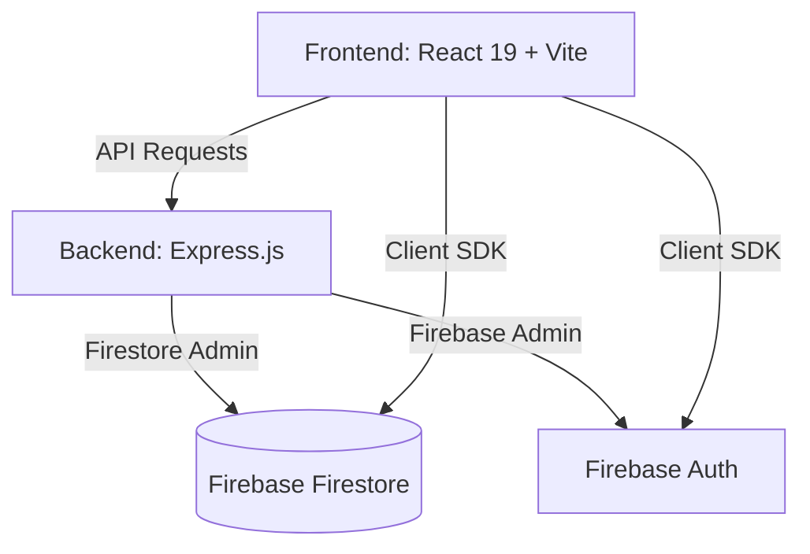

# WardroWave 2.0: Project Flow & Architecture

WardroWave 2.0 is a premium clothing rental and e-commerce platform built with a modern full-stack architecture. This document outlines the project's flow, technology stack, and core logic.

---

## 🏗️ High-Level Architecture

The project follows a decoupled architecture with a React frontend and an Express.js backend, using Firebase for real-time data and authentication.



---

## 💻 Frontend Flow (Client-Side)

### 1. Entry Point & Configuration
- **`main.jsx`**: Bootstraps the React application.
- **`App.jsx`**: Wraps the application in global providers:
  - `AuthProvider`: Manages user login state and session.
  - `WishlistProvider`: Manages saved items across the app.
  - `CartProvider`: Handles shopping cart logic (add, remove, quantity).
- **`AppRoutes.jsx`**: Defines the navigation structure using `react-router-dom`.

### 2. User Navigation Flow
- **Public Routes**:
  - `Home (/)`: Landing page with featured products and hero animations.
  - `Rentals (/rentals)`: Catalog of items available for rent.
  - `Categories (/men, /women, /accessories)`: Filtered views of the product catalog.
  - `Product Details (/product/:id)`: Detailed view with size selection and "Add to Cart".
- **Authentication Routes**:
  - `Login (/login)` & `Signup (/signup)`: Integrated with Firebase Auth.
  - `Forgot Password`: Triggers reset emails.
- **Protected Routes** (Requires Login):
  - `Profile (/profile)`: User details and order history.
  - `Virtual Closet (/virtual-closet)`: Personalized view of rented/owned items.
  - `Checkout (/checkout)`: Multi-step payment and address flow.

### 3. Styling & Animations
- **Tailwind CSS 4**: Used for modern, utility-first styling.
- **GSAP (@gsap/react)**: Powers high-end cinematic animations (e.g., hero section, scroll reveals).
- **Framer Motion**: Handles smooth page transitions and micro-interactions.

---

## ⚙️ Backend Flow (API)

The backend acts as a secure middleware between the frontend and Firebase, handling complex logic and protected data.

### 1. Request Pipeline
Every request to `/api/*` goes through:
1.  **Security Headers**: `helmet` and `cors` configuration.
2.  **Rate Limiter**: Prevents abuse (Express Rate Limit).
3.  **JSON Parser**: Handles body content up to 10MB.
4.  **Router**: Directs request to the specific module.

### 2. Core API Endpoints
- **Auth (`/api/auth`)**: Syncs Firebase Client Auth with the backend profile.
- **Users (`/api/users`)**: Manages user profiles, addresses, and settings.
- **Products (`/api/products`)**: Fetches product data from Firestore.
- **Orders (`/api/orders`)**: Handles order creation, status updates, and payment verification.

---

## 🔐 Authentication & Security Flow

WardroWave uses a hybrid Firebase authentication strategy:

1.  **Frontend**: User logs in via Firebase Client SDK.
2.  **Token Exchange**: The client sends the Firebase ID Token to the backend.
3.  **Backend Verification**: The backend uses `firebase-admin` to verify the token.
4.  **Context Sync**: User data is then stored in the `AuthContext` to be accessible globally.

---

## 🛠️ Technology Stack Summary

| Layer | Technology |
| :--- | :--- |
| **Frontend** | React 19, Vite, Tailwind CSS 4, GSAP, Framer Motion |
| **Backend** | Node.js, Express.js |
| **Database** | Firebase Firestore |
| **Auth** | Firebase Authentication |
| **Deployment** | Vercel |
| **Utilities** | Lucide React (Icons), React Hot Toast (Notifications) |

---

## 📂 Project Structure Overview

```text
/
├── api/                # Vercel Serverless Functions
├── backend/            # Express.js Source Code
│   ├── config/         # Firebase initialization
│   ├── controllers/    # Request handlers (business logic)
│   ├── middleware/     # Auth checks, Error handling
│   ├── models/         # Firestore data schemas
│   └── routes/         # API endpoint definitions
├── src/                # React Source Code
│   ├── components/     # Reusable UI elements
│   ├── context api/    # Global state (Auth, Cart, Wishlist)
│   ├── pages/          # Full page components
│   └── Routers/        # Navigation logic
└── public/             # Static assets
```
